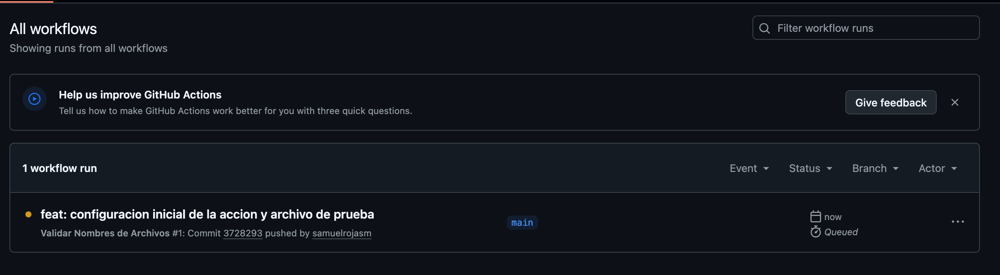
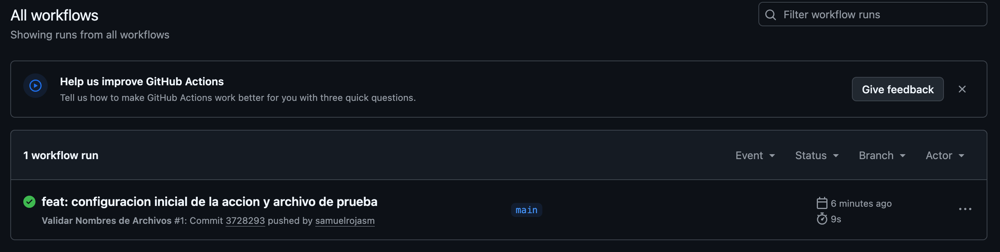
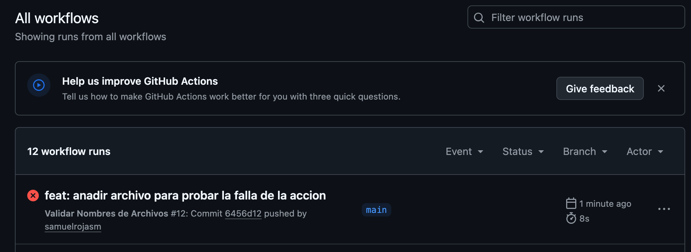
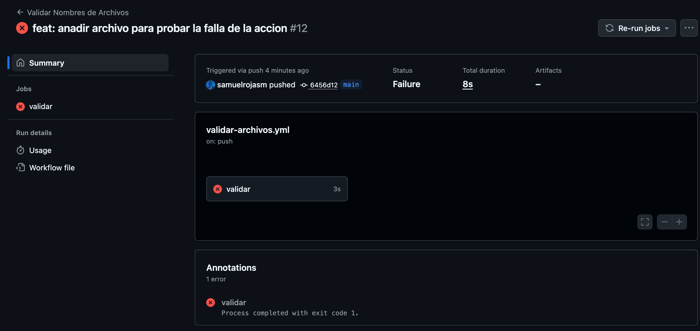

# 🧪 Lab Personal:  MVP de Github Actions 

¡Bienvenido a mi **laboratorio personal**! 🚀
Este repo es un espacio para **experimentar y aprender** sobre `Git Hub Actions`.
Aquí guardo pruebas, errores, descubrimientos y notas de aprendizaje, sin preocuparme por que todo sea perfecto. 😅

---

## 🎯 Objetivos
- Este proyecto es una prueba de concepto o un "producto mínimo viable" (despliegue mínimo y funcional) con las características más básicas necesarias para funcionar. 
- Demostración de un flujo de trabajo de GitHub Actions en acción.

## 📖 Descripción del proyecto
- Vamos a crear un proyecto que verifique los nombres de los archivos en un repositorio.
- La acción fallará si encuentra un archivo cuyo nombre contenga la palabra **"secreto"**. 
- Esto es un ejemplo simple, pero útil para demostrar el flujo de trabajo de una acción.

## ⚙ Tecnolgías usadas
- GitHub Actions
- Shell Script

## 🛠 Bloques de construcción (building blocks-the basic things that are put together to make something exist)
1. Archivo de Demostración: 
- En la carpeta raíz del repositorio existe el archivo: **archivo_normal.txt**
- Es un archivo de texto simple. Este será el archivo que nuestra acción inspeccionará.
    ```bash
    echo "Esto es un archivo de prueba." > archivo_normal.txt
    ```
2. Archivo "Malo":
- Archivo que contiene la palabra **"secreto"** en su nombre para probar que la acción falle. 
- No lo subimos al repositorio al principio de la prueba. Esto en un paso posterior para demostrar el flujo completo.
    ```bash
    echo "Esto es un archivo de prueba secreto." > archivo_secreto.txt
    ```
3. Acción de GitHub
- Las acciones se definen en un directorio llamado **.github/workflows**.
- Estructura de Directorios:
    ```bash
    mkdir -p .github/workflows
    ```
- Archivo de Flujo de Trabajo (Workflow)
    - Dentro del directorio: **.github/workflows**, existe un archivo YAML. 
        ```bash
        validar-archivos.yml
        ```

## 🚀 Demostración y Prueba del laboratorio (El MVP Funcional)
Ahora que todo está configurado, vamos a demostrar que funciona.
- **Paso 1:** Demostración Exitosa
    - Verificar de que solo el archivo **archivo_normal.txt** y la configuración de la acción existan en el directorio local. 
    - El archivo **archivo_secreto.txt** debería estar todavía fuera del control de Git (o bórralo si ya esta creado).
    - Agregar y subir los archivos:
        ```bash
        git add .
        git commit -m "feat: configuracion inicial de la accion y archivo de prueba"
        git push origin main
        ```
    - Verificar en GitHub: En el repositorio en GitHub hacer clic en la pestaña **Actions.**
    - Muestra que se está ejecutando un flujo de trabajo llamado **"Validar Nombres de Archivos".**
        <p align="center">
            
        </p>
    - Cuando termina, debería mostrar un ícono verde de éxito. 
        <p align="center">
            
        </p>

    - Hacer clic para ver los logs y confirmar que el paso **"Validar nombres"** se ejecutó con éxito.
- **Paso 2:** Demostración de Falla Intencional
    - Ahora, crear el archivo que hará que la acción falle. Si lo borramos, lo volmemos a crear.
        ```bash
        echo "Esto es un archivo de prueba secreto." > archivo_secreto.txt
        ```
    - Agregar y subir el archivo
        ```bash
        git add archivo_secreto.txt
        git commit -m "feat: anadir archivo para probar la falla de la accion"
        git push origin main
        ```
    - Verificar en GitHub: Regresar a la pestaña Actions. 
    - Se observa un nuevo flujo de trabajo en ejecución. 
         <p align="center">
            
        </p>
    - Esta vez, cuando termina, mostrará un ícono rojo de falla.
         <p align="center">
            
        </p>
    - Hacar clic para verifcar que el paso **"Validar nombres"** es el que falló, mostrando el mensaje de error que se definió.
        <p align="center">
            
        </p>
    - Llega el correo incando la falla del workflow de GitHub Actions
         <p align="center">
            
        </p>
        
## ⚡ Mejoras posibles de este Minimum Viable Product

---

## 💡 Notas de aprendizaje
- Cada cambio importante se documenta en `learning/`.
    - `learning/README.md`: Registro de avances semanales.
    - `learning/experiments/`: Scripts de prueba que no entran en el repo oficial.
    - `learning/cheatsheets/`: Comandos útiles y mini-guías para referencia rápida.

---

## 📌 Notas
> Este repo es **experimental**<br>
> Se recomienda romper cosas y aprender de los errores 😎<br>
> Este repo personal sirve como **sandbox** para probar ideas y aprender nuevas tecnologías.

---

## 🔗 Referencias
- [CyberNuclei Labs](https://github.com/cybernuclei) → repos oficiales y demos públicas.

---

### 📝 Licencia

Este repositorio está disponible bajo la licencia MIT.
Puedes usar, modificar y compartir libremente el contenido, incluso con fines comerciales.
Consulta el archivo [`LICENSE`](./LICENSE) para más detalles.

---