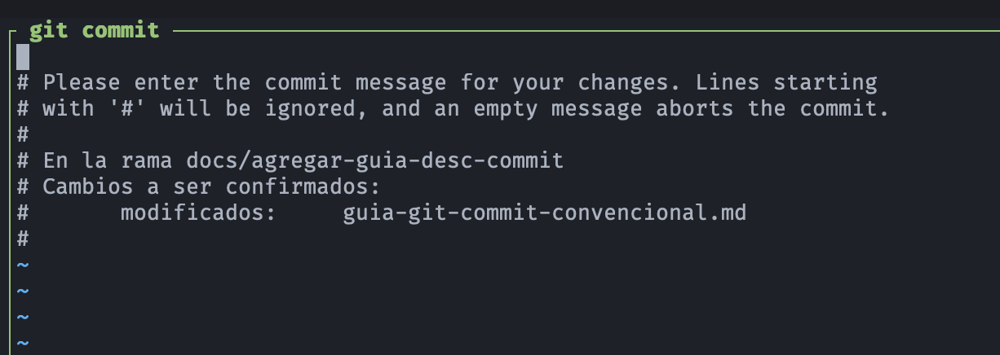

# 🧪 Guía de Git Commit Convencional

[](https://conventionalcommits.org)

## ⚙️ Recomendaciones para el mensaje de un git commit
- Un buen mensaje de git commit es claro, conciso y descriptivo. No solo sirve para entender el cambio que se realizó, sino que también facilita la revisión del código, la depuración y la generación de un historial de cambios legible. Aquí hay algunas recomendaciones clave:
    - **Línea de asunto concisa (máximo 50 caracteres)**: La primera línea debe ser un resumen breve y directo del cambio. No debe ser una frase completa, sino más bien un imperativo: "Corrige bug de autenticación" o "Añade botón de 'me gusta'".
    - **Dejar una línea en blanco**: Después de la línea de asunto, deja una línea en blanco. Esto es crucial para que herramientas como `git log`, `git shortlog` y `git rebase` funcionen correctamente y presenten la información de forma legible.
    - **Cuerpo del mensaje detallado (después de la línea en blanco)**: El cuerpo del mensaje debe explicar por qué se hizo el cambio y qué problema resuelve. ¿Qué motivó este cambio? ¿Qué efectos secundarios puede tener? Es el lugar ideal para explicar el **"por qué"** del cambio, no solo el **"qué"**.
    - **Usar el imperativo**: Escribe el mensaje como si estuvieras dando una orden. En lugar de "Se corrigió un bug...", usa "Corrige un bug...". Esto mantiene la coherencia y la claridad.
    - **Referenciar tickets o issues**: Si el cambio está relacionado con un ticket en un sistema de seguimiento de errores (como Jira, Trello, etc.), incluye el número de referencia. Esto ayuda a vincular el código con la tarea correspondiente. Por ejemplo: `[JIRA-123]`.
    - **Limitar la longitud de las líneas**: Aunque no es una regla estricta, se recomienda que las líneas no superen los **72 caracteres**. Esto mejora la legibilidad en la terminal y en diversas herramientas.

---

## ⚙️ Patrones y estándares de facto
- Existe un patrón de facto que se ha popularizado y es seguido por muchas comunidades de código abierto, especialmente la de Linux, la cual es la misma comunidad que desarrolló Git. Este patrón se conoce como **"Conventional Commits"**.
- El estándar **Conventional Commits** es una especificación ligera sobre cómo escribir mensajes de `commit`. Su objetivo es crear un historial de `commit` explícito, lo que facilita la automatización de herramientas como la generación de `changelogs` y la determinación automática de la versión semántica de un proyecto.
- El formato básico es:
> `tipo(alcance): descripción`<br>`cuerpo del mensaje`<br>`pie de página`
- A continuación, los elementos clave de este patrón:
    - `tipo`: Es una palabra clave que indica el tipo de cambio. Los más comunes son:
        - `feat`: Un nuevo **feature** o funcionalidad.
        - `fix`: Una corrección de un **bug**.
        - `docs`: Cambios en la documentación.
        - `style`: Cambios que no afectan la lógica del código (formato, espacios, etc.).
        - `refactor`: Un cambio de código que no añade funcionalidades ni corrige errores.
        - `test`: Añadir o modificar tests.
        - `chore`: Cambios en la configuración de la construcción o tareas repetitivas.
    - `(alcance)`: Opcional. Indica la parte del código que se modificó. Por ejemplo, `feat(autenticación)`.
    - `descripción`: La descripción corta y concisa, siguiendo las mismas reglas de la línea de asunto.
    - `cuerpo`: (Opcional) Un cuerpo detallado que explica el cambio.
    - `BREAKING CHANGE`: Una nota especial en el pie de página para indicar un cambio que rompe la compatibilidad (API) y que requiere una nueva versión mayor según el versionado semántico.
- El uso de **Conventional Commits** no solo estandariza el historial de commit, sino que también permite el uso de herramientas automatizadas para:
    - **Generar automáticamente archivos** `CHANGELOG`: Un registro de cambios del proyecto.
    - **Determinar automáticamente la próxima versión del proyecto**: Si hay un `feat`, podría ser un `minor release`, si hay un `fix`, un `patch release`, y si hay un `BREAKING CHANGE`, un `major release`.
    - **Facilitar la búsqueda de cambios específicos**: Permite filtrar commits por tipo o alcance de manera sencilla.

---

## ⚙️ Ejemplos
- Ejemplos de mensajes de `git commit` siguiendo el patrón **Conventional Commits** y las mejores prácticas.
    - Ejemplo 1:
        > **feat(autenticación)**: Añade inicio de sesión con redes sociales<br><br>Añade la posibilidad de que los usuarios se registren e inicien sesión usando sus cuentas de Google y Facebook. Esto mejora la experiencia del usuario y expande las opciones de registro.
    - Ejemplo 2:
        > **fix(css)**: Corrige el espaciado de los botones en la barra de navegación<br><br>Se ajustaron los márgenes y el relleno para asegurar que los botones "Inicio" y "Perfil" en la barra de navegación tengan el mismo espaciado, mejorando la consistencia del 
        diseño.
    - Ejemplo 3:
        > **docs(README)**: Actualiza las instrucciones de instalación<br><br>Se revisaron y actualizaron los pasos para instalar las dependencias del proyecto, incluyendo los comandos correctos para npm.
    - Ejemplo 4:
        > **refactor(api)**: Renombra la función `getUsers` a `fetchUsers`<br><br>El nombre `getUsers` no reflejaba adecuadamente la naturaleza asíncrona de la operación. El nuevo nombre, `fetchUsers`, es más descriptivo y coherente con el estilo de nomenclatura del proyecto.
    - Ejemplo 5:
        > **chore(deps)**: Actualiza las dependencias de producción a la última versión<br><br>Se actualizó `react-router-dom` a la versión `6.1.1` y `axios` a la versión `0.27.2` para corregir vulnerabilidades de seguridad y aprovechar las nuevas funcionalidades.

---

## ⚙️ Paso a paso para un commit completo
- La sintaxis de `git commit -m` solo te permite escribir una línea de mensaje, lo cual es ideal para mensajes simples. Sin embargo, para incluir un cuerpo de mensaje y dejar la línea en blanco, se usa un método diferente.
- La forma correcta de hacerlo desde la línea de comandos es no usar la opción `-m`. Simplemente ejecuta `git commit` sin más parámetros.
    1. **Ejecutar el comando**: En la terminal, escribir:
        ```bash
        git commit
        ```
    2. **Se abre el editor de texto**: Git abrirá el editor de texto predeterminado (por ejemplo, Vim, Nano, VS Code, etc.). Se verá una pantalla similar a esta, con comentarios que empiezan con `#`:
        <p align="center">
            
        </p>
    3. **Escribe el mensaje**:
        - En la primera línea, escribe el asunto del `commit` (por ejemplo, `feat: Añade un nuevo botón en la página principal`).
        - Luego, deja una línea en blanco.
        - En la siguiente línea, escribe el cuerpo del mensaje, explicando el porqué de tu cambio.
    4. **Guarda y sal del editor**: Una vez escrito el mensaje, guardar el archivo y ciérralo.
        - En vi, presionar `Esc`, luego escribir `:wq` y presiona `Enter`.
        - En Nano, presionr `Ctrl + O`, `Enter` y luego `Ctrl + X`.
    > Al hacer esto, Git leerá el mensaje completo (incluyendo el salto de línea y el cuerpo) y lo guardará en el `commit`. De esta manera, el historial de Git se mantendrá claro, descriptivo y fácil de navegar para nosotros y el equipo.<br><br>Recordar que si en algún momento se desea volver a la forma corta para un `commit` rápido, siempre se puede usar `git commit -m "Mensaje simple"`.

---

## ⚙️ Práctica común de uso de mensajes git commit 
-  La preferencia y la práctica común se pueden deducir por los siguientes factores:
### `git commit -m` es la más usada para commits pequeños y rápidos
- La sintaxis `git commit -m` es extremadamente común para cambios menores, como correcciones de errores tipográficos, ajustes de formato, o cualquier cosa que no requiera una explicación detallada. Es la forma más rápida y directa de hacer un commit.
    - **Ventaja**: Rapidez y conveniencia.
    - **Contexto de uso**: Proyectos personales, correcciones rápidas, `commits` que no afectan la lógica principal.
### `git commit` (sin `-m`) es la práctica recomendada para `commits` significativos
- La comunidad de desarrollo, especialmente en proyectos de código abierto y en entornos de trabajo profesional, prioriza un historial de `commit` legible y detallado. El uso de `git commit` sin `-m` (que abre el editor) es la forma estándar de lograrlo.
    - **Ventaja**: Permite crear mensajes de `commit` completos y descriptivos, con un asunto, un cuerpo y un pie de página. Esto es crucial para la revisión de código, la depuración y la generación automática de registros de cambios (changelogs).
    - **Contexto de uso**: Nuevas funcionalidades, refactorizaciones, correcciones de errores complejos, cambios que impactan a otros desarrolladores.
### Conclusión
- No es una cuestión de "una u otra", sino de contexto. La mayoría de los desarrolladores usan ambas herramientas, pero con propósitos distintos:
    - Se inclinan por `git commit -m` para commits simples, rápidos y de una sola línea.
    - Utilizan `git commit` (sin la opción `-m`) para commits que necesitan una explicación más detallada.
> En el desarrollo profesional y en proyectos que siguen estándares como **"Conventional Commits"**, la práctica de escribir un mensaje de `commit` completo (con asunto y cuerpo) usando el editor es considerada una buena práctica fundamental. El mensaje de `commit` es un registro permanente de por qué se hizo un cambio, y para los cambios significativos, ese "por qué" es tan importante como el "qué".

---

## ⚙️  Registrar el commit inicial de un proyecto
- El mensaje `chore: init` se usa para registrar el `commit` inicial de un proyecto, indicando que se trata de una tarea de configuración (un `chore`) y no de una funcionalidad o corrección. Es una forma estandarizada de decir: "Este es el primer `commit` del proyecto con la configuración inicial".
- Este mensaje específico indica dos cosas:
    - `chore`: Este es el **tipo** de cambio. Según la convención, `chore` se usa para cambios en el proceso de construcción, herramientas auxiliares o librerías que no modifican el código de producción. Un `commit` de tipo `chore` no arregla un bug ni añade una nueva funcionalidad.
    - `init`: Esta es la **descripción** del cambio. En este contexto, `init` es la abreviatura de "initialize" (inicializar), lo que significa que este es el primer `commit` del proyecto. A menudo, se utiliza para guardar el esqueleto inicial del proyecto, como la configuración, un archivo README, o la estructura básica de carpetas.
-  En resumen, el mensaje `chore: init` se usa para registrar el **commit inicial de un proyecto**, indicando que se trata de una tarea de configuración (un `chore`) y no de una funcionalidad o corrección. Es una forma estandarizada de decir: "Este es el primer `commit` del proyecto con la configuración inicial".

---

## 🔗 Referencias
- [Conventional Commits](https://www.conventionalcommits.org)
- [GitHub Conventional Commits](https://github.com/conventional-commits/conventionalcommits.org)

---