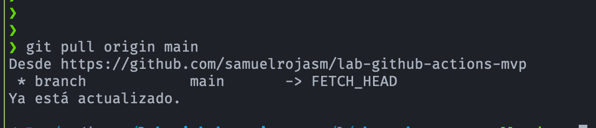
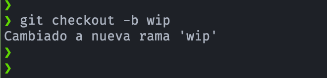

# 🧪 Guia para trabajar con el flujo de trabajo de Trunk-based Development

## ⚙️ Comandos de Git: Para trabajar con el flujo de trabajo de Trunk-based Development
### 1. Clonar el repositorio
- Para empezar a trabajar, clona el repositorio principal (el trunk o rama `main`) en tu máquina local.
    ```bash
    git clone <URL_del_repositorio>
    cd <nombre_del_repositorio>
    ```
### 2.Mantener tu rama local actualizada
- Antes de empezar a trabajar en una nueva funcionalidad o corrección, es crucial que tu rama local `main` esté sincronizada con el repositorio remoto. Esto ayuda a evitar conflictos.
    ```bash
    git pull origin main
    ```
    <p align="center">
        
    </p>

### 3. Crear una rama de corta duración
- En el enfoque de Trunk-based, se crean ramas para funcionalidades o correcciones de bugs, pero estas ramas son de corta duración (duración de horas o un día como máximo). El objetivo es que se fusionen con la rama principal lo antes posible. 🚀
    ```bash
    git checkout -b <nombre_de_tu_rama>
    ```

    <p align="center">
        
    </p>

- El comando `git checkout -b` se usa para crear y cambiar a una nueva rama de Git en un solo paso. Es una abreviación de dos comandos:
    1. `git branch <nombre-de-la-rama>`: crea una nueva rama.
    2. `git checkout <nombre-de-la-rama>`: cambia a esa nueva rama.

### 4. Trabajar, hacer "commits" y subir cambios
- Trabaja en tu funcionalidad, haz commits de forma frecuente y sube tus cambios a la rama remota.
    ```bash
    # Después de hacer tus cambios...
    git add .
    git commit -m "Descripción clara de tu cambio"
    git push origin <nombre_de_tu_rama>
    ```
- Para subir una nueva rama local a GitHub y que se cree en el repositorio remoto, debes usar el comando `git push`. La primera vez que lo haces, es una buena práctica usar la opción `--set-upstream` (o su versión corta `-u`), para que Git asocie tu rama local con la nueva rama remota. El comando completo es:
    ```bash
    git push --set-upstream origin <nombre-de-la-rama>
    ````
> Después de ejecutar este comando, Git recordará que tu rama local está vinculada a la rama remota que acabas de crear. A partir de ese momento, podrás usar el simple `git push` para subir tus cambios a esa rama específica.

### 5. Fusionar la rama con el tronco principal
- Una vez que tu trabajo esté completo y revisado (usualmente a través de una **"pull request"** o **"merge request"**), se fusiona con la rama `main`.
    ```bash
    # Primero, asegúrate de estar en la rama 'main'
    git checkout main

    # Luego, fusiona tu rama de funcionalidad
    git merge --no-ff <nombre_de_tu_rama>
    
    # O, si prefieres una fusión "squash" para un solo commit
    git merge --squash <nombre_de_tu_rama>
    git commit -m "Descripción de la funcionalidad completa"

    # Sube el cambio fusionado al repositorio remoto
    git push origin main
    ```
> La fusión --no-ff (no fast-forward) es a menudo preferida porque crea un commit de fusión explícito, lo que ayuda a mantener un historial claro de los cambios.<br>
> El comando `git merge --no-ff` sí crea automáticamente un commit de fusión, por lo que no es necesario ejecutar `git commit` después.
### 6. Eliminar la rama de corta duración
- Una vez que la funcionalidad ha sido fusionada y el código está en el tronco principal, la rama de corta duración ya no es necesaria y se puede eliminar.
    ```bash
    # Eliminar la rama local
    git branch -d <nombre_de_tu_rama>

    # Eliminar la rama remota
    git push origin --delete <nombre_de_tu_rama>
    ```

---

## ⚙️ ¿Cómo funciona git merge --no-ff?
- Cuando Git realiza un **"fast-forward merge"** (fusión de avance rápido), simplemente mueve el puntero de la rama `main` a la última confirmación de la rama de la característica, sin crear un nuevo commit. Esto ocurre solo si la rama `main` no ha tenido nuevos commits desde que se creó la rama de la característica.
- Sin embargo, al usar el comando **git merge --no-ff**, estás forzando a Git a crear un commit de fusión  de forma explícita, incluso si pudiera realizar un "fast-forward". Este commit de fusión es importante porque:
    - **Preserva el historial:** Mantiene un registro de que una rama de característica se fusionó con la rama principal. Esto es útil para auditar el historial de cambios y entender de dónde provienen las funcionalidades.
    - **Permite deshacer:** Si necesitas revertir un cambio grande de una característica, puedes revertir un solo commit (el commit de fusión), en lugar de tener que deshacer varios commits de forma individual.

---

## ⚙️ Diferencia con git merge --squash
- La opción `--squash` tiene un comportamiento diferente.
    - `git merge --squash`: Combina todos los commits de la rama de la característica en un solo commit. Después de ejecutar este comando, Git deja los cambios listos en tu área de preparación, pero no los confirma. Por lo tanto, sí necesitas ejecutar un `git commit` manualmente después para finalizar la fusión.
    - En resumen:

    | Comando|Crea un commit de forma automática|
    |:-------|:--------------|
    |`git merge --no-ff`|Sí|
    |`git merge --squash`|No (requiere `git commit` posterior)|

> El comando `--no-ff` es el más utilizado en un flujo de trabajo de **Trunk-based Development** porque ayuda a mantener un historial claro y auditable de las fusiones.

---

## ⚙️ ¿Cómo se ejecuta el deshacer los cambios de un no-fast-forward?
- Para deshacer un **"merge no-fast-forward"** de forma segura, el comando más recomendado es `git revert`. 
- Este método es ideal para ramas que ya han sido compartidas con otros, ya que no reescribe el historial del repositorio.
- El comando para revertir un merge commit es:
    ```bash
    git revert -m <numero_del_padre> <hash_del_commit>
    ```
- ¿Cómo funciona el comando?
    - `git revert`: Este comando no borra el commit original. En su lugar, crea un nuevo commit que aplica los cambios inversos. Es como si agregaras un nuevo commit que desactiva todos los cambios que se hicieron en la fusión. Esto mantiene un historial limpio y seguro para todos los colaboradores.
    - `-m <numero_del_padre>`: La opción `-m` (mainline) es obligatoria cuando reviertes un commit de fusión. Un merge commit tiene dos o más "padres", es decir, de dónde provienen los cambios. El `--no-ff` tiene dos:
        1. El primer padre (`-m 1`) es la rama a la que se fusionó (por ejemplo, `main`).
        2. El segundo padre (`-m 2`) es la rama que se fusionó (por ejemplo, `feature-branch`).
    - Al usar `-m 1`, le estás diciendo a Git que quieres revertir los cambios de la rama `feature-branch`, dejando intacta la rama main hasta ese punto. Si no especificas el número del padre, Git no sabrá qué parte de la fusión quieres deshacer.
    - `<hash_del_commit>`: Es el identificador del commit de fusión que quieres revertir. Puedes encontrarlo con `git log`.
    - Ejemplo práctico: Supongamos que hiciste un `git merge --no-ff` en la rama `main`, y el commit de fusión tiene el hash `a1b2c3d4`.
        1. Busca el hash del merge commit con `git log`. Verás una línea que dice "Merge: `<padre1> <padre2>`".
        2. Para deshacer la fusión, ejecuta el siguiente comando:
            ```bash
            git revert -m 1 a1b2c3d4
            ```
    - Git creará un nuevo commit que revierte todos los cambios que vinieron de la rama de la característica, dejando el historial de la rama `main` sin alterar.

- Alternativa a `git revert` -> `git reset`
    - Si la fusión aún no se ha subido al repositorio remoto y no ha sido compartida, puedes usar `git reset`. 
    - Este comando sí reescribe el historial y es más directo. Sin embargo, su uso en ramas compartidas puede causar problemas a otros desarrolladores.
    - El comando sería:
        ```bash
        git reset --hard HEAD~1
        ```
    > Este comando mueve el puntero de la rama `main` un commit atrás, al estado justo antes de la fusión. El `merge commit` desaparecerá del historial.

---


